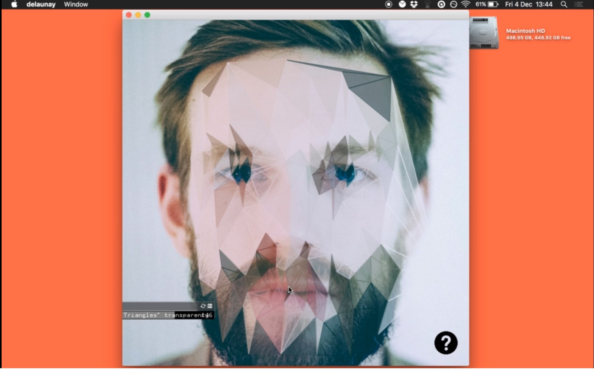

# delaunay

A small image editing program to interactively create delaunay triangulations out of photos in open frameworks.

Made for a small piece of uni coursework.

### non-native dependencies:

- [ofxDelaunay](https://github.com/obviousjim/ofxDelaunay/)
